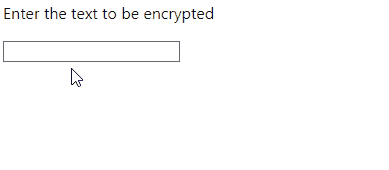

# Cipher13

This application simply returns Rot13.



## API Endpoints

```bash
$ curl http://localhost:8080/api/rot13?s=test-strings
  % Total    % Received % Xferd  Average Speed   Time    Time     Time  Current
                                 Dload  Upload   Total   Spent    Left  Speed
100    50  100    50    0     0   1219      0 --:--:-- --:--:-- --:--:--  1515{"original":"test-strings","rot13":"grfg-fgevatf"}
```

## License
MIT

## Author
Kenta Goto
